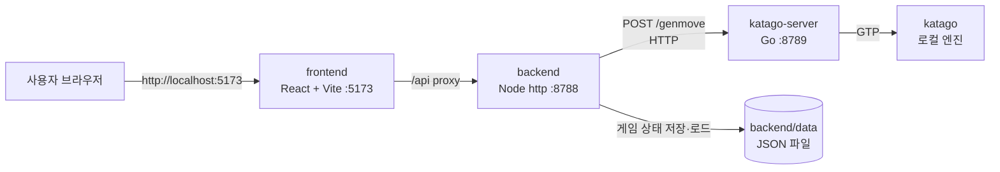

# play361 (local)

`baduk-game` 프로젝트의 **완전 로컬 실행 클론**. AWS 중계(Lambda · SQS · DynamoDB · CloudFront) 없이 이 컴퓨터 한 대에서 프론트엔드 · 백엔드 · KataGo 서버가 모두 실행되어 바둑 대국을 즐길 수 있다.

UI와 게임 기능은 원본 `baduk-game`을 그대로 사용하며, AWS 전송 계층만 로컬 HTTP로 치환했다.

## 구조



| 구성요소 | 위치 | 기술 | 역할 |
|---|---|---|---|
| frontend | `frontend/` | React + Vite | 바둑판 UI. 원본과 동일. `/api` 요청을 Vite 프록시로 백엔드에 전달 |
| backend | `backend/` | Node.js `http` | API 서버. 원본 relay-server 라우팅 재사용. 게임 상태는 로컬 파일에 저장 |
| katago-server | `katago-server/` | Go | KataGo 엔진을 GTP로 구동. 원본 katago-agent의 GTP 로직 재사용 |

원본과 달라진 부분은 **전송 계층뿐**이다.

- SQS + DynamoDB 폴링 → `backend → katago-server` 로컬 HTTP 동기 호출
- DynamoDB 게임 상태 테이블 → `backend/data/<sessionId>.json` 파일
- CloudFront 로그 집계 대시보드(`/analytics`) → 백엔드의 빈 응답 스텁 (화면은 그대로 뜨고 "데이터 없음" 표시)

## 사전 요구사항

- [Node.js](https://nodejs.org/) 18 이상
- [Go](https://go.dev/) 1.24 이상
- [KataGo](https://github.com/lightvector/KataGo) — macOS: `brew install katago`

KataGo 바이너리 · 모델 · 설정 파일 기본 경로는 아래와 같으며, 환경변수로 바꿀 수 있다.

| 환경변수 | 기본값 |
|---|---|
| `KATAGO_PATH` | `/opt/homebrew/bin/katago` |
| `KATAGO_MODEL` | `/opt/homebrew/share/katago/kata1-b18c384nbt-s9996604416-d4316597426.bin.gz` |
| `KATAGO_CONFIG` | `/opt/homebrew/share/katago/configs/gtp_example.cfg` |
| `KATAGO_HUMAN_MODEL` | (미설정) — 설정 시 급수별 사람 같은 기풍 사용 |

## 실행

최초 1회 프론트엔드 의존성 설치:

```bash
cd frontend && npm install
```

세 컴포넌트를 한 번에 실행:

```bash
bash scripts/dev.sh
```

브라우저에서 http://localhost:5173 접속.

### 개별 실행

```bash
# KataGo 서버 (:8789)
cd katago-server && go build -o katago-server . && ./katago-server

# 백엔드 (:8788)
cd backend && node server.js

# 프론트엔드 (:5173)
cd frontend && npm run dev
```

## API

백엔드가 제공하는 엔드포인트 (원본 relay-server와 동일).

| 메서드 | 경로 | 설명 |
|---|---|---|
| `GET` | `/api/v1/health` | 상태 확인 |
| `POST` | `/api/v1/genmove` | AI 다음 수 계산 |
| `POST` | `/api/v1/score` | 형세 판단 |
| `POST` | `/api/v1/game/save` | 게임 상태 저장 |
| `GET` | `/api/v1/game/load?sessionId=...` | 게임 상태 로드 |
| `DELETE` | `/api/v1/game?sessionId=...` | 게임 상태 삭제 |
| `GET` | `/api/v1/analytics` | 방문 통계 (로컬 스텁, 빈 데이터) |

`genmove` 요청 예시:

```json
{
  "board_size": 19,
  "komi": 6.5,
  "moves": [{ "color": "B", "position": "D4" }],
  "color_to_play": "W",
  "rank": "5k"
}
```

`rank`는 `20k`~`7d`. Human SL 모델이 없으면 `maxVisits` + `temperature` 폴백 설정으로 강도를 조절한다.
