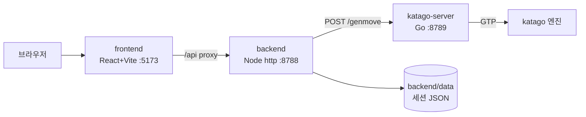

# play361 (로컬) — AS-IS 요약

> DATE: **2026.07.03** · 본문: [`system-design-as-is.md`](./system-design-as-is.md) · 근거: [`_evidence-brief.md`](../_evidence-brief.md)
> 5분 안에 현 시스템의 전반과 문제를 파악하는 인덱스.

## ① 한눈에 보기



## ② 요지

- **play361** 은 한 컴퓨터에서 실행되는 3-티어 로컬 바둑 게임이다. 브라우저 → 프론트엔드 → 백엔드 → KataGo 서버 순으로 대국을 처리한다.
- 착수 1회마다 **전체 기보**를 서버로 보내고 KataGo 가 기보를 재생 후 다음 수를 계산한다(서버 무상태).
- 게임 상태는 backend 가 세션별 JSON 파일로 저장, AI 는 katago-server 가 단일 KataGo 프로세스로 처리.
- 약점: 자동화 테스트 부재(🟠) · 개발 프록시 전용 연결(🟡) · 엔진 타임아웃 미설정(🟡) · 동시 대국 불가(🟡).

## ③ 최소 조각

| 조각 | 종류 | 한 줄 책임 |
|---|---|---|
| `useGame` | 프론트 오케스트레이터 | 바둑판 상태·착수·AI 요청 흐름 소유 |
| `api/relay.js` | 프론트 게이트웨이 | genmove/hint/score 요청(재시도·타임아웃) |
| `logic/rules.js` | 프론트 워커 | 착수·따냄·패 규칙 연산(무상태) |
| `server.js` | 백엔드 오케스트레이터 | 검증·저장·KataGo 호출 라우팅 |
| `validator.mjs` | 백엔드 워커 | 요청 스키마 검증(무상태) |
| `katago-client.mjs` | 백엔드 게이트웨이 | katago-server 로 HTTP 전달 |
| `game-store.mjs` | 백엔드 게이트웨이 | 게임 상태 JSON 파일 저장·조회 |
| `katago.go` | 카타고서버 상세 워커 | GTP 로 기보 재생·genmove·형세 |

## ④ 대표 흐름 — 착수 1회

```jobflow
scope: play361
Object: Browser, Frontend, Backend, KataGoServer, KataGoEngine
Browser.OnClick --> Frontend.PlaceStone
Frontend.PlaceStone.result --> Backend.message.genmove
Backend.message.genmove --> KataGoServer.message.genmove
KataGoServer.message.genmove --> KataGoEngine.message.gtp
KataGoEngine.message.gtp.result --> Frontend.PlaceAIMove
```

- 흑 착수 → 백엔드 → katago-server → KataGo 엔진 → 다음 수 응답 → 백 착수 반영. (본문 §5-1)

## ⑤ 핵심 발견 이슈

| ID | 심각도 | 위치 | 한 줄 |
|---|---|---|---|
| R-06 | 🟠 P1 | 저장소 전체 | 자동화 테스트 없음(수동 검증만) |
| R-01 | 🟡 운영 | `katago-client.mjs` | 백엔드→엔진 fetch 타임아웃 없음 |
| R-03 | 🟡 운영 | `vite.config.js` | 개발 프록시 전용, 프로덕션 서빙 없음 |
| R-05 | 🟡 운영 | `katago.go` | 단일 KataGo 직렬화로 동시 대국 불가 |
| R-04 | 🟢 부채 | `useGame.js` | 단일 훅 책임 과다(약 450줄) |
| R-02 | 🟢 부채 | `game-store.mjs` | traversal 방어가 500+스택트레이스 |
| R-07 | 🟢 부채 | `server.js`/`relay.js` | `/score` 경로 대국 루프 미사용 |
| R-08 | 🟢 부채 | `config.go` | KataGo 경로 homebrew 하드코딩 |

## ⑥ 본문 앵커 인덱스

| 섹션 | 내용 |
|---|---|
| [§0](./system-design-as-is.md#0-한눈에-보기--aws-없이-한-컴퓨터에서-도는-3-티어-바둑) | 조감 |
| [§1](./system-design-as-is.md#1-input-datas) | Input Datas |
| [§2](./system-design-as-is.md#2-key-events) | Key Events |
| [§3](./system-design-as-is.md#3-services-list) | Services List(6모듈) |
| [§4](./system-design-as-is.md#4-pbs-기능-트리) | PBS |
| [§5](./system-design-as-is.md#5-job-flow) | Job Flow(4계층) |
| [§6](./system-design-as-is.md#6-navigation) | Navigation |
| [§7](./system-design-as-is.md#7-state) | State |
| [§8](./system-design-as-is.md#8-screen-layout) | Screen Layout |
