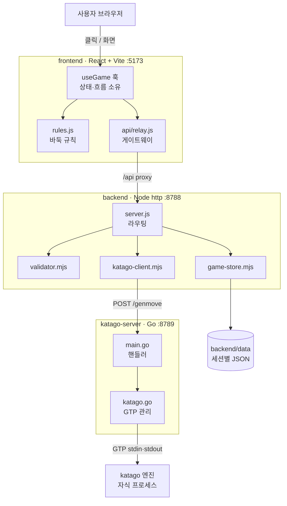
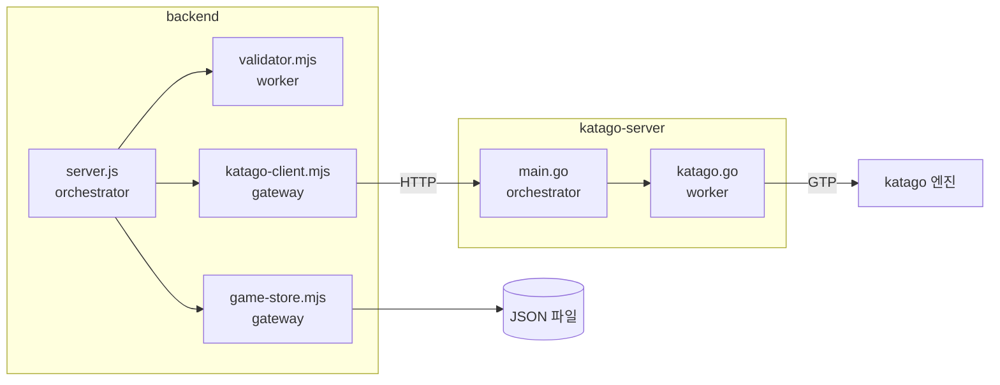
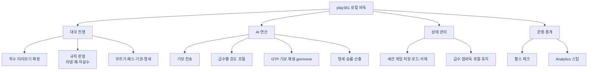

# play361 (로컬) — AS-IS 시스템 설계 분석

> DATE: **2026.07.03** · 근거: [`_evidence-brief.md`](../_evidence-brief.md) · 요약: [`summary.md`](./summary.md)
> 현 코드를 있는 그대로 역추출한다(개선·목표는 TO-BE 의 몫). 다이어그램이 1차 표현이며 설명은 최소한으로 짧게 쓴다.

---

## 0. 한눈에 보기 — 한 컴퓨터에서 도는 3-티어 로컬 바둑



**범례**: 굵은 테두리=핵심 책임 · 화살표=요청/응답 방향.
play361 은 한 컴퓨터에서 실행되는 3-티어 바둑 게임이다. 브라우저의 프론트엔드가 백엔드 API 를 호출하고, 백엔드는 KataGo 서버를 통해 바둑 AI 연산을 수행한다.

**요지**
- **전체 그림**: 브라우저 → frontend(:5173) → 개발 프록시 → backend(:8788) → katago-server(:8789) → katago 엔진. 응답은 역방향. (§5 매크로)
- **핵심 책임·데이터 흐름**: 착수 1회마다 `전체 기보`를 backend 로 보내고, katago-server 가 KataGo 에 기보를 재생 후 다음 수를 계산해 돌려준다. 상태는 서버가 갖지 않고 매 요청에 기보 전부를 실어 보낸다(stateless 재생 방식). (§1, §5 상세)
- **게임 저장**: 세션별 게임 상태는 backend 가 `backend/data/<sessionId>.json` 파일로 보관한다. (§3, §7)
- **현 구조 약점**: 🟠 자동화 테스트 부재(R-06) · 🟡 개발 프록시 전용 연결(R-03) · 🟡 백엔드→엔진 타임아웃 미설정(R-01) · 🟡 단일 KataGo 직렬화로 동시 대국 불가(R-05).

---

## 1. Input Datas

시스템이 받는 원천 데이터.

| 데이터 | 출처 | 방식 | 비고 |
|---|---|---|---|
| 착수(교차점 클릭) | 사용자 | 이벤트 | 데스크톱=즉시 착수, 모바일=미리보기 후 확정 (E1 `useGame`) |
| 급수 `rank`·접바둑 `handicap` | 사용자 선택 | 이벤트 | `localStorage` 에 유지. rank 는 `20k`~`7d` |
| 전체 기보 `moves` | 프론트가 매 요청 구성 | 요청당 1회 | `{color, position(GTP)}` 배열. 서버 무상태 재생의 입력 (E3, E7) |
| `board_size`·`komi` | 프론트 | 요청당 1회 | 19로 고정, 접바둑 시 komi 0.5 |
| KataGo 모델·설정·바이너리 경로 | 환경변수/기본값 | 기동 시 1회 | homebrew 기본 경로 하드코딩(R-08, E9) |

## 2. Key Events

로직을 작동시키는 트리거.

| 이벤트 | 발생 | 처리 |
|---|---|---|
| 사용자 착수 | 교차점 클릭/확정 | `useGame` 이 규칙 검증 후 흑 착수 → AI 요청 트리거 |
| AI 수 요청 완료 | backend 응답 | 백 착수 반영·승률/집수 갱신·기권/쌍방패스 판정 |
| 힌트 요청 | 힌트 버튼 | `rank=7d` 로 genmove 를 호출해 추천 수 표시 |
| 게임 상태 변경 | 착수·급수·점수 변동 | 1초 디바운스 후 서버 저장(E6) |
| 프로세스 기동 | `run.sh`/`dev.sh` | katago-server 가 KataGo 자식 프로세스 기동·GTP 준비(E7,E8) |
| GTP 읽기 타임아웃 | KataGo 300초 초과 | `tainted` 표시 → 다음 요청 시 프로세스 재시작(E8) |

## 3. Services List

### 6모듈 분류 (근사 매핑 — 근거 브리프 §4 한계 참조)

| 모듈(가이드) | frontend | backend | katago-server |
|---|---|---|---|
| **Main(Orchestrator)** | `useGame` 훅 | `server.js` `handleRequest` | `main.go` `run`/핸들러 |
| **core(최상위 Worker)** | `components/*`, `logic/rules.js` | `validator.mjs` | `katago.go` KataGo |
| **gateways(외부 통신)** | `api/relay.js`·`api/gameState.js` | `katago-client.mjs`·`game-store.mjs` | KataGo GTP stdin/stdout |
| **service(싱글톤 상태)** | — | — | KataGo 프로세스(장수명 1개) |
| **utils(무상태)** | `logic/coordinates.js`·`audio/*` | — | `logging.go`·`config.go` |
| **config** | `vite.config.js` | 환경변수 | `config.go` |

> `service`·`core` 경계는 코드에 뚜렷하지 않다. KataGo 프로세스만이 사실상 단일 인스턴스 공유 자원(service 성격)이다.

### 모듈 경계 (orchestrator → worker 단방향, gateway 캡슐화)



- backend 의 `server.js` 는 워커(`validator`)·게이트웨이(`katago-client`,`game-store`)를 단방향 호출한다.
- 외부 통신은 게이트웨이에 캡슐화된다: KataGo 는 `katago-client`(HTTP)→`main.go`→`katago.go`(GTP), 저장은 `game-store`(파일).
- 워커끼리 직접 호출은 없다(요청/응답 파이프라인이라 자연히 성립).

## 4. PBS (기능 트리)



- 4개 기능 그룹: 대국 진행 · AI 연산 · 상태 관리 · 운영.
- AI 연산 그룹이 이 시스템의 핵심으로, 기보를 KataGo 에 넘겨 다음 수·형세를 계산한다.
- 운영 그룹의 Analytics 는 로컬에선 빈 스텁 응답을 반환한다.

## 5. Job Flow

### 5-1. 매크로 (L1 · 외부 경계) — `scope`

프로세스 4개가 HTTP·GTP 메시지로 협력한다. 흐름을 총괄하는 단일 객체가 없으므로 `scope`.

```jobflow
scope: play361
Object: Browser, Frontend, Backend, KataGoServer, KataGoEngine
Browser.OnClick --> Frontend.PlaceStone
Frontend.PlaceStone.result --> Backend.message.genmove
Backend.message.genmove --> KataGoServer.message.genmove
KataGoServer.message.genmove --> KataGoEngine.message.gtp
KataGoEngine.message.gtp.result --> KataGoServer.message.genmove.result
KataGoServer.message.genmove.result --> Backend.message.genmove.result
Backend.message.genmove.result --> Frontend.PlaceAIMove
```

- 사용자가 돌을 놓으면 프론트가 흑 착수를 반영하고 `genmove` 메시지를 백엔드에 보낸다.
- 백엔드는 이를 katago-server 로, katago-server 는 KataGo 엔진에 GTP 로 넘긴다.
- 엔진의 응답(다음 수)이 역방향으로 흘러 프론트가 백 착수로 그린다.
- 경계는 전부 HTTP(프론트↔백↔카타고) 와 GTP(카타고↔엔진) 메시지다.

### 5-2. 시스템/모듈 (L3 · backend) — `orchestrator: BackendServer`

```jobflow
orchestrator: BackendServer
Object: BackendServer, Validator, KataGoClient, GameStore
BackendServer.OnGenmove --> Validator.validateGenmoveRequest
Validator.validateGenmoveRequest.false --> BackendServer.OnGenmove.result
Validator.validateGenmoveRequest.true --> KataGoClient.sendToKataGo
KataGoClient.sendToKataGo.result --> BackendServer.OnGenmove.result
BackendServer.OnSave --> GameStore.saveGameState
BackendServer.OnLoad --> GameStore.loadGameState
GameStore.loadGameState.result --> BackendServer.OnLoad.result
```

- `server.js` 가 유일한 흐름 제어자다. 요청을 받아 검증→전달→응답으로 잇는다.
- 검증 실패면 곧바로 400 을 반환(`.false`), 통과면 게이트웨이로 넘긴다(`.true`).
- 저장/로드는 `game-store` 게이트웨이가 파일로 처리한다.

### 5-3. 시스템/모듈 (L3 · katago-server) — `orchestrator: KataGoServer`

```jobflow
orchestrator: KataGoServer
Object: KataGoServer, KataGo
KataGoServer.OnGenmove --> KataGo.GenMove
KataGo.GenMove.result --> KataGoServer.OnGenmove.result
KataGoServer.OnScore --> KataGo.EstimateScore
KataGo.EstimateScore.result --> KataGoServer.OnScore.result
```

- `main.go` 핸들러가 요청 `type` 에 따라 `GenMove` 또는 `EstimateScore` 를 부른다.
- KataGo 워커의 결과(수·승률·집수)를 그대로 JSON 응답으로 내보낸다.

### 5-4. 상세 (L4 · KataGo GTP 관리) — `orchestrator: KataGo`

가장 복잡한 워커. 매 요청마다 기보를 처음부터 재생한다.

```jobflow
orchestrator: KataGo
Object: KataGo, GTP
KataGo.GenMove --> KataGo.restartIfTainted
KataGo.GenMove --> GTP.clear_board
KataGo.GenMove --> GTP.boardsize
KataGo.GenMove --> GTP.komi
KataGo.GenMove --> GTP.play
KataGo.GenMove --> KataGo.applyRankSettings
KataGo.applyRankSettings --> GTP.kata_set_param
KataGo.GenMove --> GTP.genmove
GTP.genmove.result --> KataGo.estimateScoreRaw
KataGo.estimateScoreRaw --> GTP.kata_raw_nn
GTP.kata_raw_nn.result --> KataGo.GenMove.result
```

- 요청 시작 시 이전 타임아웃으로 오염(`tainted`)됐으면 프로세스를 재시작한다.
- 보드 초기화 → 크기·덤 설정 → 기보 전 수 재생(`play`) → 급수별 파라미터 적용.
- `genmove` 로 다음 수를 얻고, `kata-raw-nn` 으로 승률·집수를 덧붙여 반환한다.
- 이 재생 방식 때문에 서버는 게임 상태를 보관하지 않아도 된다(무상태).

### 5-5. 상세 (L4 · frontend) — `orchestrator: useGame`

```jobflow
orchestrator: useGame
Object: useGame, Rules, Relay, GameState
useGame.placeDirectly --> Rules.tryPlace
Rules.tryPlace.result --> useGame.requestAI
useGame.requestAI --> Relay.requestAIMove
Relay.requestAIMove.result --> Rules.tryPlace
useGame.requestAI --> GameState.saveGameToServer
```

- 사용자 착수는 `rules.tryPlace` 로 규칙 검증 후 보드에 반영된다.
- 이어 `requestAI` 가 relay 게이트웨이로 AI 수를 요청하고, 받은 수를 다시 `tryPlace` 로 반영한다.
- 상태 변경은 디바운스되어 `gameState` 게이트웨이로 저장된다.

## 6. Navigation

```navigation
Home --> (/api/v1/game/load)
(/api/v1/game/load) --> Home
Home --> (validation)
(validation) --> (/api/v1/genmove)
(/api/v1/genmove) --> Home : success
(/api/v1/genmove) --> Home : error 재시도
Home --> (/api/v1/game/save)
Home --> Analytics
Analytics --> (/api/v1/analytics)
(/api/v1/analytics) --> Analytics
Home --> Privacy
```

- 진입 시 `game/load` 로 이전 대국을 복원한다(있으면).
- 착수는 로컬 규칙 검증 후 `genmove` 를 호출하고, 실패 시 relay 가 최대 4회 재시도한다.
- 변경은 `game/save` 로 저장된다. `/analytics`·`/privacy` 는 별도 화면(경로 기반 라우팅, `main.jsx`).

## 7. State

### 7-1. 대국 상태 (`useGame`)

```state
<s> --> (Preview)
(Preview) --> (BlackToPlay) : 게임 시작·착수
(BlackToPlay) --> (AIThinking) : 흑 착수 완료
(AIThinking) --> (BlackToPlay) : 백 착수 반영
(AIThinking) --> (GameOver) : 기권·쌍방패스
(BlackToPlay) --> (GameOver) : 쌍방패스
(GameOver) --> <e>
```

- 시작 전엔 접바둑 미리보기 상태다. 착수하면 흑 차례↔AI 사고 상태를 오간다.
- 기권 또는 연속 2패스면 종료된다. 무르기는 흑 차례로 되돌린다(도식 생략).

### 7-2. KataGo 프로세스 수명 (`katago.go`)

```state
<s> --> (Starting)
(Starting) --> (Ready) : protocol_version 응답
(Ready) --> (Busy) : GenMove·EstimateScore
(Busy) --> (Ready) : 응답 완료
(Busy) --> (Tainted) : GTP 읽기 타임아웃
(Tainted) --> Restart : 다음 요청
Restart --> (Ready)
(Ready) --> <e> : Quit
```

- 기동 후 GTP 준비되면 Ready. 요청 처리 중엔 Busy(뮤텍스로 직렬화).
- 300초 내 응답이 없으면 Tainted 로 표시되고, 다음 요청 때 프로세스를 재시작해 복구한다(R-05 관련).

## 8. Screen Layout

```layout
V(Logo, GameArea)
GameArea > (Board, SidePanel)
SidePanel V(PlayerInfo, WinRateBar, RankHandicapSelect, MoveCount, Controls)
Controls > (Hint, Undo, Pass, StartOrEnd)
```

- 상단 로고 아래 좌측 큰 바둑판, 우측 사이드 패널.
- 패널은 대국자 정보·승률 바·급수/접바둑 선택·착수 수·컨트롤 버튼을 세로로 쌓는다.

---

## 근거 ↔ 섹션 ↔ 이슈 매핑

| 근거(E) | 본문 섹션 | 관련 이슈 |
|---|---|---|
| E3 `server.js` | §3, §5-2, §6 | R-02, R-07 |
| E5 `katago-client.mjs` | §3, §5-2 | R-01 |
| E6 `game-store.mjs` | §3, §5-2, §7 | R-02 |
| E7 `main.go` | §3, §5-3 | R-07 |
| E8 `katago.go` | §5-4, §7-2 | R-05 |
| E1 `useGame`/`relay.js` | §5-5, §7-1 | R-04 |
| E2 `vite.config.js` | §6 | R-03 |
| E9 `config.go` | §1, §3 | R-08 |
| 저장소 전체 | — | R-06 |

## 종료 보고 (AS-IS 검증)

- **정규 8섹션(§1~§8) 완비**, §0 두괄식 조감 포함. §5 는 `jobflow` DSL 로 4계층 전개(sequenceDiagram 미사용).
- **깊이 한계**: L4 상세는 `katago.go`·`useGame` 두 곳만 실재하여 그만큼만 전개했다(없는 계층 날조 안 함). 이 시스템은 이벤트 기반 O-W 가 아닌 HTTP 요청/응답 파이프라인이라 6모듈 분류는 근사이며 `service`/`core` 경계는 약하다.
- **6원칙 위반(노출만)**: 수평적 고립·단방향 제어는 파이프라인 특성상 성립. 다만 `useGame` 훅의 책임 과다(R-04)는 O-W "단일 책임" 관점의 약점으로 남긴다(AS-IS 에서 교정하지 않음).
- **남은 P1**: R-06(테스트 부재). TO-BE 입력으로 인계.
