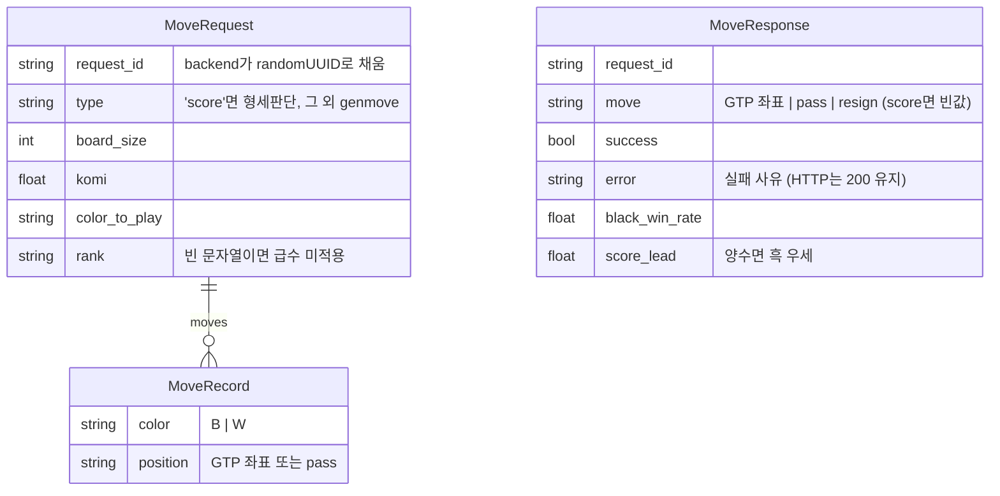

# AS-IS 상세 — 데이터·계약 (Input Datas)

> 대상: 핵심 문서 [§1 Input Datas](../system-design-as-is.md)
> 근거: [_evidence-brief.md](../../_evidence-brief.md) §1 근거 인벤토리 (frontend `api/`·`hooks/`, backend 전체, katago-server `models.go`)

## 1. 브라우저 localStorage 키

| 키 | 값 | 생성 시점 | 소비 시점 | 근거 |
|---|---|---|---|---|
| `play361_session_id` | UUID(`crypto.randomUUID`) | 최초 저장/로드 요청 시 없으면 생성 | 저장·로드·삭제 API 의 `sessionId` | `gameState.js:5-12` |
| `play361_rank` | `'15k'`…`'7d'` (기본 `'5k'`) | 급수 셀렉트 변경 | 초기 상태·genmove `rank` | `useGame.js:11,32-34,470-476` |
| `play361_handicap` | `'0'`,`'2'`…`'9'` (기본 `'0'`) | 치석 셀렉트 변경 | 초기 보드 미리배치·접바둑 시작 | `useGame.js:12,36-38,478-489` |
| `play361_muted` | `'0'`/`'1'` | 사운드 토글 | 효과음 재생 여부 | `stoneSound.js:5-7,76-80` |

- `resetSessionId()`(게임 종료 버튼)는 `play361_session_id` 만 지운다 — 급수·치석·음소거는 유지된다.

## 2. 게임 상태 직렬화 스키마 (`serializeGameState`, `useGame.js:73-89`)

파일 저장 형식: `backend/data/games/<sessionId>.json` = `{ "gameState": { ...아래 필드 } }` (`game-store.mjs:17-20`)

| 필드 | 타입 | 의미 |
|---|---|---|
| `board` | `number[19][19]` | 0 빈칸 · 1 흑 · 2 백 |
| `currentColor` | `1\|2` | 다음 착수 색 |
| `moves` | `{color, x, y}\|{color, pass:true}[]` | 전체 수순(접바둑 치석 포함) — genmove replay 의 원천 |
| `ko` | `{x,y}\|null` | 직전 패 금지점 |
| `lastMove` | `{x,y,color}\|null` | 마지막 착수 마커 |
| `consecutivePasses` | `number` | 연속 패스 수(2면 종료) |
| `gameOver` / `endReason` | `bool` / `'resign'\|'double_pass'\|null` | 종료 여부·사유 |
| `rank` / `handicap` | `string` / `number` | AI 급수·치석 수 |
| `gameStarted` | `bool` | 설정 잠금·저장 트리거 조건 |
| `history` | snapshot[] | 무르기 스택(`board·ko·lastMove·moves·consecutivePasses·score`) |
| `score` | `{blackWinRate, scoreLead}\|null` | 최근 형세(genmove 응답 동봉값) |

- 역직렬화(`deserializeGameState`)는 `board`·`moves` 가 없으면 null 을 반환해 새 게임으로 취급한다. UI 휘발 필드(`aiThinking`·`preview`·`hint` 등)는 저장하지 않는다.

## 3. HTTP API 계약 전문 (backend :8788)

| 메서드·경로 | 요청 | 성공 응답 | 오류 |
|---|---|---|---|
| `GET /api/v1/health` | — | `{status:'ok'}` | — |
| `POST /api/v1/genmove` | `{board_size, komi, moves[], color_to_play, rank?}` | KataGo `MoveResponse` 그대로 중계 | 400 검증 실패 · 500 `{error: err.message}` |
| `POST /api/v1/score` | `{board_size, komi, moves[]}` | `{black_win_rate, score_lead, ...}` | 동일 (⚠️ UI 미사용 — R-06) |
| `POST /api/v1/game/save` | `{sessionId, gameState}` | `{success:true}` | 400 필드 누락 · 500 |
| `GET /api/v1/game/load?sessionId=` | — | `{gameState}` (없으면 `{gameState:null}`) | 400 · 500 |
| `DELETE /api/v1/game?sessionId=` | — | `{success:true}` (없어도 성공) | 400 · 500 |
| `GET /api/v1/analytics` | `?days=`(무시) | 빈 스텁 `{data:[], summary:{0...}, topUrls:[], timestamp}` | — |

검증 규칙(`validator.mjs`): `board_size` 정수 2~25 · `komi` number · `moves[].color ∈ {B,W}` · `moves[].position` 비어있지 않은 문자열 · `color_to_play ∈ {B,W}` · `rank` 는 `^\d+[kd]$` (⚠️ 지원 테이블과 불일치 — R-05).

## 4. backend ↔ katago-server 계약 (`models.go`)

- katago-server 는 **엔진 실패도 HTTP 200 + `success:false`** 로 돌려준다(`writeFailure`, `main.go:106-113`). HTTP 비정상은 katago-server 자체 장애일 때만.
- `black_win_rate = 1 − whiteWin`, `score_lead = −whiteLead` 로 `kata-raw-nn 0` 출력을 흑 기준으로 뒤집는다(`katago.go:204-235`).

## 5. GTP 좌표 규약 (`coordinates.js`)

- 열 문자 `ABCDEFGHJKLMNOPQRST`(I 제외), 행은 `19 − y`. 예: `(3,15)` → `D4`.
- `pass`/`resign` 은 좌표 변환 없이 문자열 그대로 오간다. `fromGTP` 는 범위 밖·pass·resign 에 null 반환.

## 6. 환경변수·설정 파일

| 변수 | 기본값 | 소비자 |
|---|---|---|
| `PORT` | `8788` | backend 리슨 포트 |
| `GAME_DATA_DIR` | `<cwd>/data/games` | 게임 파일 디렉토리 |
| `KATAGO_SERVER_URL` | `http://localhost:8789` | backend → katago-server |
| `LISTEN_ADDR` | `:8789` | katago-server 리슨 |
| `KATAGO_PATH` | `/opt/homebrew/bin/katago` | 엔진 바이너리 |
| `KATAGO_MODEL` | homebrew 기본 모델 경로 | 신경망 가중치 |
| `KATAGO_HUMAN_MODEL` | (미설정) | 설정 시 Human SL 기풍 테이블 사용 |
| `KATAGO_CONFIG` | `gtp_example.cfg` | GTP 설정 |

- `sessionId` 는 파일명이 되므로 `^[A-Za-z0-9-]+$` 로 제한해 경로 탈출을 막는다(`game-store.mjs:10-15`).
- katago-server 로그: `logs/agent-YYYY-MM-DD.log` JSON, 7일 보관 후 자동 삭제(`logging.go`).
