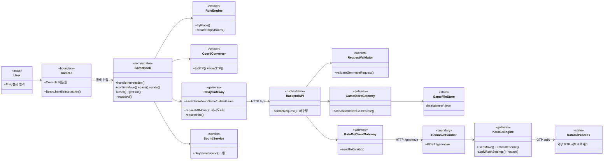

# AS-IS 상세 — 서비스·모듈 구조 (Services List)

> 대상: 핵심 문서 [§3 Services List](../system-design-as-is.md)
> 근거: [_evidence-brief.md](../../_evidence-brief.md) §1 근거 인벤토리·§3 최소 조각

## 1. 전체 정적 구성 (classDiagram)

class 는 실제 OOP 클래스가 아니라 시스템 이해에 필요한 구성 단위다.

## 2. 서비스별 6모듈 분류 (근거 라인 포함)

### frontend (React 19 + Vite)

| 모듈 | 파일 | 분류 | 근거 관찰 |
|---|---|---|---|
| 진입/라우팅 | `main.jsx` | Main(조립) | `location.pathname` 으로 App/Analytics/Privacy 3분기 — 라우터 라이브러리 없음 |
| 화면 조립 | `App.jsx` | Main(조립) | Logo·Board·GameInfo·Controls 조립, 오버레이·토스트 소유 |
| 게임 오케스트레이터 | `hooks/useGame.js` | **Main(Orchestrator)** | 상태 1개(useState)에 게임 전체 보유, 모든 사용자 동작의 콜백 제공 |
| 규칙 | `logic/rules.js` | utils(무상태) | 순수 함수 — 따냄·자살수·단순 패 판정 |
| 좌표 | `logic/coordinates.js` | utils(무상태) | GTP 좌표 변환 |
| API | `api/relay.js`·`api/gameState.js` | gateways | fetch 캡슐화, 65s 타임아웃·재시도 / 세션 ID 관리 |
| 사운드 | `audio/stoneSound.js` | service | 모듈 전역 AudioContext 싱글톤 (⚠️ R-02) |
| UI | `components/Board.jsx`·`GameInfo.jsx`·`Controls.jsx` | core(Worker) | props 만 받는 표시 전용 — 형제·상위를 모름 |

### backend (Node.js 내장 http, 의존성 0)

| 모듈 | 파일 | 분류 | 근거 관찰 |
|---|---|---|---|
| 서버·라우팅 | `server.js` | Main | if 체인 라우팅 7개 엔드포인트, 페이로드 조립·오류 응답 직접 수행 |
| 검증 | `validator.mjs` | utils(무상태) | genmove/score 요청 검증 순수 함수 |
| KataGo 중계 | `katago-client.mjs` | gateway | fetch 1회, 타임아웃 없음 (⚠️ R-03) |
| 게임 저장 | `game-store.mjs` | gateway | 파일 CRUD, sessionId 문자 제한 |

### katago-server (Go, 표준 라이브러리만)

| 모듈 | 파일 | 분류 | 근거 관찰 |
|---|---|---|---|
| 기동·핸들러 | `main.go` | Main | Config 로드 → KataGo 기동 → `GET /health`·`POST /genmove` 등록. type=score 분기 |
| 엔진 | `katago.go` | **core+gateway 결합** | GTP 프로세스 소유(mutex 직렬화)·급수 테이블·형세 파싱·taint 복구가 한 파일(591줄) |
| 설정 | `config.go` | config | 환경변수 5종 |
| DTO | `models.go` | utils | MoveRequest/MoveResponse |
| 로깅 | `logging.go` | service | slog 전역 + 일별 회전·7일 보관 |

## 3. 책임 소유 표

| 책임 | 소유 조각 | 비고 |
|---|---|---|
| 바둑 규칙 판정(합법수·따냄·패) | `RuleEngine`(frontend) | 서버는 규칙을 전혀 모름 — KataGo replay 시 GTP 오류로만 걸러짐 |
| 대국 흐름·턴 관리 | `GameHook` | AI 차례 진입·차단·재개 모두 여기 |
| 종료 판정 | `GameHook` | 쌍방 패스·AI 기권·자동기권(200수↑·AI 승률<0.5%) |
| 세션 식별 | `RelayGateway`(gameState.js) | localStorage UUID — 서버는 받은 값 사용만 |
| 게임 영속화 | `GameStoreGateway`+`GameFileStore` | 파일 1세션 1JSON, TTL 없음(무한 보관) |
| AI 강도 정책 | `KataGoEngine` | 급수→GTP 파라미터 테이블 2벌(human/fallback) |
| KataGo 생존성 | `KataGoEngine` | taint 마킹 → 다음 요청에서 재기동 |
| 입력 검증 | `RequestValidator`(backend) | frontend 는 별도 요청 검증 없음 |

## 4. 설계 원칙 위반 노출 (AS-IS 그대로 — 교정하지 않음)

| 이슈 | 원칙 세트·조항 | 관찰 근거 |
|---|---|---|
| R-01 | **O-W 6원칙** §3 Orchestrator 제약("직접 비즈니스 로직 연산 지양") | `useGame.js` 가 직렬화(73-89)·저장 스케줄(112-119)·접바둑 구성(121-139)·자동기권 판정(199-212)을 직접 수행 |
| R-02 | **O-W 6원칙** 상태 공유(Service 분리·주입) | `saveTimer` 모듈 전역(112), 모듈 로드 시 localStorage 접근(48)·AudioContext 생성(stoneSound.js:9-16) — 주입 없는 전역 공유 |
| — | **method-R 6원칙** 조각 간 무지 | `katago.go` 내부에서 워커 로직(급수 정책)과 게이트웨이(프로세스 IO)가 서로를 직접 참조(파일 결합) — 위반이라기보다 분리 미도달, TO-BE 후보 |
| 준수 | O-W 단방향 제어·수평 고립 | 전 계층에서 오케스트레이터→워커 단방향, 워커 간 직접 호출 없음 확인 |
| 준수 | O-W 외부 접근 캡슐화 | HTTP·파일·서브프로세스 접근이 모두 gateway 파일에 격리 |

## 5. 근거문서 ↔ 본문 섹션 ↔ 이슈 매핑

| 근거(브리프 인벤토리 행) | 본문 섹션 | 관련 이슈 |
|---|---|---|
| frontend 오케스트레이터 (`useGame.js`) | §0·§3·§5·§7 | R-01·R-02·R-08 |
| frontend 게이트웨이 (`relay.js`·`gameState.js`) | §1·§5·§6 | R-03·R-06·R-07 |
| backend 전체 | §1·§3·§5 | R-03·R-09 |
| katago-server (`katago.go`) | §3·§5·§7 | R-03·R-04·R-05 |
| 실행 스크립트·README | §0 | R-05(문서-코드 불일치) |
