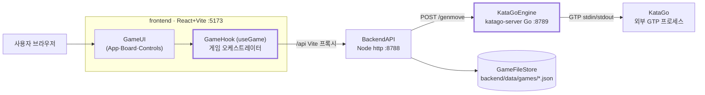
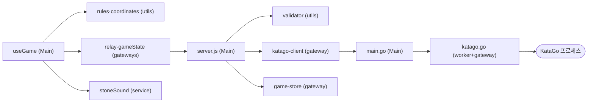
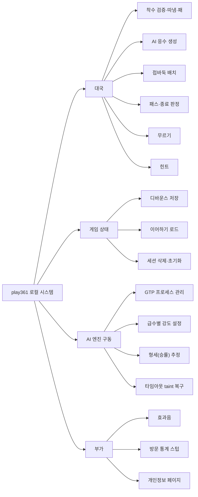

# play361 (local) — AS-IS 설계 분석

> DATE: 2026.07.19 · 근거: [_evidence-brief.md](../_evidence-brief.md) (소스코드 직접 분석)
> 다이어그램 표기는 project-guides 의 `jobflow`·`navigation`·`state`·`layout` DSL 을 따른다. 깊은 내용은 [details/](./details/) 상세 파일에 있다.

## 0. 한눈에 보기 — 3프로세스 동기 HTTP 파이프라인



- 사용자가 착수하면 프론트엔드의 `useGame` 훅이 규칙 검증 후 backend 에 AI 응수를 요청한다.
- backend 는 검증·중계만 하고, katago-server 가 KataGo 서브프로세스를 GTP(Go Text Protocol, 바둑 엔진 텍스트 프로토콜)로 부려 수를 만든다.
- 게임 상태는 브라우저가 만든 세션 ID 기준으로 backend 가 JSON 파일에 저장해 재접속 시 이어진다.

**요지**
- 원본 play361.com 의 AWS 중계(SQS·DynamoDB)를 **로컬 동기 HTTP + 파일 저장**으로 치환한 완전 로컬 클론이다.
- 게임 규칙·상태·흐름 조율의 중심은 프론트엔드 **`useGame` 훅 하나**다. 서버 두 개는 상태 없이 요청 단위로만 동작하며, AI 강도는 katago-server 의 급수별 GTP 파라미터 테이블이 정한다.
- 현 구조 약점: `useGame` 책임 집중(R-01), 계층별 타임아웃 불일치로 재시도 중복 큐잉(R-03), KataGo 단일 프로세스 직렬화 병목(R-04).

최소 조각(전체 8개 — [브리프 §3](../_evidence-brief.md)):

| 조각 | 종류 | 한 줄 책임 | 위치 |
|---|---|---|---|
| User | Actor | 착수·설정 입력, 결과 확인 | 브라우저 |
| GameUI | Boundary/UI | 바둑판 렌더·입력 수집·정보 표시 | `frontend/src/App.jsx`·`components/` |
| GameHook | Orchestrator | 게임 상태 보유·대국 흐름 조율 | `frontend/src/hooks/useGame.js` |
| RuleEngine | Worker | 착수 합법성·따냄·패 판정 | `frontend/src/logic/rules.js` |
| RelayGateway | Gateway | AI 요청·게임 저장 API 캡슐화 | `frontend/src/api/` |
| BackendAPI | Boundary | 요청 검증·중계·게임 파일 CRUD | `backend/server.js` |
| KataGoEngine | Gateway+Worker | KataGo GTP 구동·급수 설정·형세 추정 | `katago-server/` |
| GameFileStore | State | 세션별 게임 상태 JSON 파일 | `backend/data/games/` |

핵심 발견 이슈(전체 9건은 [브리프 §2](../_evidence-brief.md)):

| ID | 심각도 | 위치 | 한 줄 |
|---|---|---|---|
| R-01 | 🟠 P1 | `useGame.js` | 오케스트레이터 훅이 직렬화·저장·접바둑·자동기권 등 비즈니스 로직까지 수행(O-W 6원칙 §3 Orchestrator 제약 위반) |
| R-03 | 🟠 P1 | `relay.js`·`katago-client.mjs`·`katago.go` | 타임아웃 65초/무제한/300초 불일치 — 재시도가 KataGo 큐에 중복 적재 |
| R-04 | 🟡 운영 | `katago.go` | 단일 KataGo 프로세스 mutex 직렬화 병목 + 매 요청 전체 수순 replay |
| R-05 | 🟡 운영 | `validator.mjs`·`katago.go` | rank 검증과 지원 테이블 불일치 — 미지원 급수는 조용히 기본 강도 |
| R-02 | 🟢 기술부채 | `useGame.js`·`stoneSound.js` | 모듈 전역 mutable 상태·로드 시점 사이드이펙트 |

## 1. Input Datas

분해 기준: 데이터의 발생 위치(브라우저 입력 / 브라우저 보관 / 서버 보관 / 환경 설정).

- 사용자 입력: 착수 클릭·터치(모바일은 미리보기 후 확인), 급수(15k~7d)·치석(호선, 2~9점) 선택, 패스·무르기·힌트·게임 시작/종료 버튼.
- 브라우저 localStorage: `play361_session_id`(UUID)·`play361_rank`·`play361_handicap`·`play361_muted`.
- 서버 보관: `backend/data/games/<sessionId>.json` — 이어하기의 원천(보드·수순·설정·승률 전체 직렬화).
- AI 요청 payload: `board_size`(19 고정)·`komi`(호선 6.5 / 접바둑 0.5)·`moves`(GTP 좌표)·`color_to_play`·`rank`.

→ 상세: [details/as-is-1-data-contracts.md](./details/as-is-1-data-contracts.md) (스키마·API 계약 전문·환경변수 9종·ER 다이어그램)

## 2. Key Events

분해 기준: 게임 흐름을 움직이는 트리거만 나열(렌더링 이벤트 제외).

- 페이지 로드 → 저장된 게임 자동 로드(이어하기), 없으면 새 대국 설정 화면.
- 착수 클릭/터치 → 규칙 검증 → AI 응수 요청(50ms 지연 후).
- 게임 상태 변경 후 1초 디바운스 → 서버 저장(`gameStarted` 상태에서만).
- AI 응답 수신(착수/패스/기권) → 보드·승률 갱신·종료 판정. 65초 무응답이면 자동 재시도(최대 4회)+토스트.
- 쌍방 패스·AI 기권·AI 자동기권(200수 이상 + AI 승률 0.5% 미만) → 대국 종료 오버레이.

상세 없음 — 이벤트별 흐름은 §5·§6 상세 파일이 담당.

## 3. Services List

분해 기준: 프로세스 경계 3개(frontend/backend/katago-server), 각 내부는 O-W 6모듈 분류.

| 모듈 분류 | frontend | backend | katago-server |
|---|---|---|---|
| Main (Orchestrator) | `useGame.js` | `server.js` | `main.go` |
| core (Worker) | `Board`·`GameInfo`·`Controls`(UI) | — | `katago.go`(GTP 워커 겸 게이트웨이) |
| gateways | `relay.js`·`gameState.js` | `katago-client.mjs`·`game-store.mjs` | `katago.go`(서브프로세스 접근) |
| service | `stoneSound.js`(모듈 전역 싱글톤) | — | `logging.go`(전역 slog) |
| utils | `rules.js`·`coordinates.js` | `validator.mjs` | `models.go`(DTO) |
| config | `vite.config.js`(프록시) | 환경변수 인라인 | `config.go` |



- 호출은 왼쪽(오케스트레이터)에서 오른쪽(워커·게이트웨이)으로만 흐른다 — 단방향 제어는 지켜진다.
- 외부 접근(HTTP·파일·서브프로세스)은 모두 gateway 파일로 캡슐화되어 있다.
- 다만 `katago.go` 는 워커(급수 로직)와 게이트웨이(프로세스 관리)가 한 파일에 결합되어 있다.

→ 상세: [details/as-is-3-services-modules.md](./details/as-is-3-services-modules.md) (classDiagram·책임 소유 표·원칙 위반 근거·이슈 매핑)

## 4. PBS

분해 기준: 시스템 → 기능 그룹 → 단위 프로세스(코드에 실재하는 기능만).



- 대국 그룹의 규칙 판정은 전부 프론트엔드에서, AI 응수만 서버 체인에서 수행된다.
- 형세 추정은 별도 화면 없이 genmove 응답에 동봉되어 승률 게이지로 표시된다.
- 방문 통계는 로컬 스텁이라 항상 빈 데이터를 반환한다(화면만 유지).

상세 없음 — 각 프로세스의 실제 흐름은 §5 상세 파일이 담당.

## 5. Job Flow Diagram

분해 기준: 시스템 계층 대표 1장 — 착수부터 AI 응수 반영·자동 저장까지 전 구간 관통. `HandleAIResult` 는 코드상 `requestAI` 함수 후반부를 메서드 경계로 표기한 것.

```jobflow
orchestrator: GameHook
Object: User, GameUI, GameHook, RuleEngine, RelayGateway, BackendAPI, KataGoEngine, GameFileStore

User.On착수 --> GameHook.HandleIntersection
GameHook.HandleIntersection --> RuleEngine.TryPlace
RuleEngine.TryPlace.false
RuleEngine.TryPlace.true --> GameHook.RequestAI
GameHook.RequestAI --> RelayGateway.RequestAIMove
RelayGateway.RequestAIMove --> BackendAPI.HandleGenmove
BackendAPI.HandleGenmove --> KataGoEngine.GenMove
KataGoEngine.GenMove.result --> BackendAPI.HandleGenmove.result
BackendAPI.HandleGenmove.result --> RelayGateway.RequestAIMove.result
RelayGateway.RequestAIMove.result --> GameHook.HandleAIResult
GameHook.HandleAIResult.착수 --> RuleEngine.TryPlace
RuleEngine.TryPlace.result --> GameUI.message.보드갱신
GameHook.HandleAIResult.패스기권 --> GameUI.message.종료표시
GameHook.OnStateChanged --> RelayGateway.SaveGame
RelayGateway.SaveGame --> BackendAPI.HandleGameSave
BackendAPI.HandleGameSave --> GameFileStore.SaveGameState
```

- 사용자가 놓은 수를 GameHook 이 RuleEngine 으로 검증한다. 불법 수(`false`)는 후속 흐름 없이 그대로 무시된다(화살표 없는 분기 — 화면 무반응).
- 합법 수면 GameHook 이 전체 수순을 GTP 좌표로 바꿔 RelayGateway → BackendAPI → KataGoEngine 체인으로 AI 수를 받아온다.
- AI 응답이 좌표면 다시 RuleEngine 으로 반영하고, 패스·기권이면 종료 판정으로 흐른다.
- 어떤 경로든 상태가 바뀌면 1초 뒤 저장 체인이 파일까지 이어진다.

→ 상세: [details/as-is-5-job-flows.md](./details/as-is-5-job-flows.md) (매크로·모듈·상세 계층 전체 jobflow와 예외 분기)

## 6. Navigation Diagram

분해 기준: 화면 3개(GameBoard·Analytics·Privacy)와 화면 이동·판단에 관여하는 API 만.

```navigation
Browser --> GameBoard : / 접속
GameBoard --> (/api/v1/game/load)
(/api/v1/game/load) --> GameBoard : saved, 이어하기
(/api/v1/game/load) --> GameBoard : empty, 새 대국 설정
GameBoard --> (validate_move) : 착수
(validate_move) --> GameBoard : illegal
(validate_move) --> (/api/v1/genmove) : legal
(/api/v1/genmove) --> GameBoard : ai_move
(/api/v1/genmove) --> GameBoard : resign_or_double_pass, 종료 오버레이
GameBoard --> (/api/v1/game/save) : 상태 변경 1초 후
GameBoard --> (/api/v1/game) : 게임 종료 버튼, DELETE 후 초기화
Browser --> Analytics : /analytics 접속
Analytics --> (/api/v1/analytics)
(/api/v1/analytics) --> Analytics : empty_stub
Browser --> Privacy : /privacy 접속
```

- 라우터 라이브러리 없이 `main.jsx` 가 `location.pathname` 으로 세 화면 중 하나를 고른다(화면 간 링크 이동 없음).
- GameBoard 는 단일 화면 안에서 로드→대국→종료 오버레이→초기화가 모두 일어난다.
- Analytics 는 로컬 스텁 응답이라 항상 "데이터 없음" 상태로 뜬다.

→ 상세: [details/as-is-6-navigation-scenarios.md](./details/as-is-6-navigation-scenarios.md) (시나리오별 navigation·트리거·예외)

## 7. State Diagram

분해 기준: 대국 라이프사이클(useGame 상태 필드의 조합) 1장.

```state
<s> --> (Setup)
(Setup) --> (BlackTurn) : 호선 첫 착수
(Setup) --> (AITurn) : 접바둑 시작
(BlackTurn) --> (AITurn) : 착수 또는 패스
(AITurn) --> (BlackTurn) : AI 착수 또는 패스
(AITurn) --> (GameOver) : AI 기권, 자동기권, 쌍방 패스
(BlackTurn) --> (GameOver) : 쌍방 패스
(BlackTurn) --> (BlackTurn) : 무르기
(GameOver) --> (BlackTurn) : 무르기
(GameOver) --> (Setup) : 게임 종료 버튼
```

- Setup 은 급수·치석을 고를 수 있는 유일한 구간이며, 첫 착수(또는 접바둑 시작)로 잠긴다.
- AITurn 동안 사용자 입력은 차단되고 THINKING 배지가 표시된다.
- 무르기는 흑 차례 스냅샷으로 되돌리며, 종료 상태에서도 대국을 재개할 수 있다.

→ 상세: [details/as-is-7-state-lifecycle.md](./details/as-is-7-state-lifecycle.md) (KataGo 프로세스·세션 데이터 상태 포함)

## 8. Screen Layout

분해 기준: 기본(모바일 세로) 레이아웃 1장 — 데스크톱은 같은 구성의 가로 재배치.

```layout
Screen V LogoHeader, BoardSection, Sidebar
LogoHeader > LogoIcon, LogoText, SoundToggle
BoardSection V BoardCanvas
Sidebar V PlayerCards, WinRateGauge, InfoBar, ControlsSection
PlayerCards > BlackPlayerCard, AIPlayerCard
InfoBar > RankSelect, HandicapSelect, MoveCounter
ControlsSection V ConfirmButton, ActionRow
ActionRow > HintButton, UndoButton, PassButton, ResetButton
```

- 위에서부터 로고 헤더 → 정사각 바둑판 → 사이드바(플레이어 카드·승률 게이지·설정·버튼) 순의 세로 적층이다.
- 착수 확인(ConfirmButton)은 모바일에서만 렌더된다.
- 데스크톱(폭 768px 이상·가로형)은 바둑판 좌측 / 사이드바 우측 가로 배치로 바뀐다.

→ 상세: [details/as-is-8-screen-layout.md](./details/as-is-8-screen-layout.md) (데스크톱·Analytics·Privacy 레이아웃)

## 상세 파일 인덱스

| 파일 | 대상 | 한 줄 |
|---|---|---|
| [as-is-1-data-contracts.md](./details/as-is-1-data-contracts.md) | §1 | 게임 상태 스키마·API 계약 전문·localStorage·환경변수·ER |
| [as-is-3-services-modules.md](./details/as-is-3-services-modules.md) | §3 | 전체 classDiagram·책임 소유 표·원칙 위반 근거·근거↔섹션↔이슈 매핑 |
| [as-is-5-job-flows.md](./details/as-is-5-job-flows.md) | §5 | 매크로~상세 계층별 전체 jobflow·기동·예외/오류 분기 |
| [as-is-6-navigation-scenarios.md](./details/as-is-6-navigation-scenarios.md) | §6 | 시나리오별 navigation 블록과 상세 설명 |
| [as-is-7-state-lifecycle.md](./details/as-is-7-state-lifecycle.md) | §7 | 대국·KataGo 프로세스·세션 데이터 상태 전이 |
| [as-is-8-screen-layout.md](./details/as-is-8-screen-layout.md) | §8 | 데스크톱 분기·Analytics·Privacy layout |

§2 Key Events · §4 PBS 는 핵심 문서 요약이 전부라 상세 없음.
